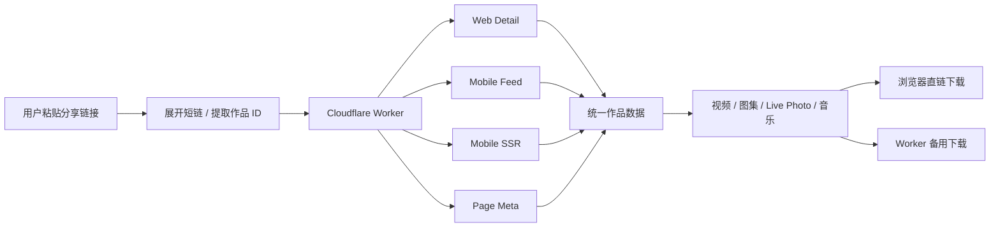
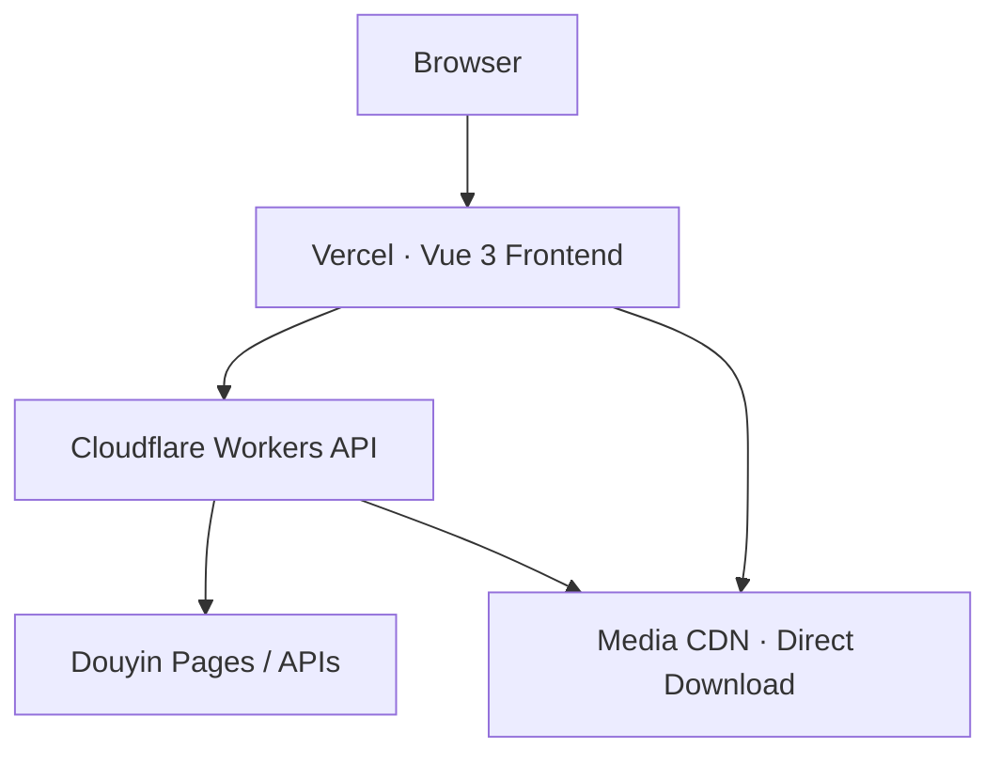

<div align="center">

# 🎬 Video Parser

**轻量、现代的短视频 / 图文作品解析下载工具**

粘贴抖音分享链接，即可解析视频、图集、Live Photo 实况与背景音乐。  
无需安装客户端，打开网页即可使用。

<p>
  <a href="https://wind-video.ccwu.cc/"><strong>🌐 在线体验</strong></a>
  ·
  <a href="https://api.wind-video.ccwu.cc/api/health">API 状态</a>
</p>

<p>
  
  
  
  
  
</p>

</div>

---

## ✨ 项目亮点

| 能力 | 说明 |
| --- | --- |
| 🎞️ **视频解析** | 解析公开抖音作品，自动选择更高质量的视频流 |
| 🖼️ **图文解析** | 支持普通图集、Slides、高清图片资源 |
| 🌄 **Live Photo** | 识别实况动态轨，可分别下载静态图与 MP4 |
| 🎵 **背景音乐** | 上游返回音乐资源时可单独下载 |
| ⚡ **双通道下载** | 优先浏览器直链下载，失败后自动切换 Worker 代理 |
| 🏷️ **友好文件名** | 自动生成“平台_作者_标题_作品ID”格式文件名 |
| 🛡️ **接口保护** | HTTPS 校验、媒体域名白名单、请求大小限制、Cloudflare 限流 |
| 📱 **响应式页面** | PC 和手机均可使用，支持下载进度、取消、批量下载 |

> 当前正式支持 **抖音**。快手、小红书、TikTok 等平台已预留 Parser 扩展结构，但暂未开放。

---

## 🌐 在线体验

👉 **[https://wind-video.ccwu.cc/](https://wind-video.ccwu.cc/)**

Demo API：

```text
https://api.wind-video.ccwu.cc
```

Demo API 健康检查：

```text
https://api.wind-video.ccwu.cc/api/health
```

---

## 📦 支持内容

| 内容类型 | 解析 | 下载 | 备注 |
| :--- | :---: | :---: | --- |
| 普通视频 | ✅ | ✅ | 自动选择较高画质流 |
| 视频封面 | ✅ | ✅ | 支持独立下载 |
| 普通图集 | ✅ | ✅ | 支持单张 / 批量下载 |
| 无水印原图 | ✅ | ✅ | 仅明确命中可信无水印字段时标记 |
| Live Photo | ✅ | ✅ | 静态图 + MP4 动态轨 |
| 背景音乐 | ✅ | ✅ | 视作品返回数据而定 |
| 私密 / 权限作品 | ❌ | ❌ | 不绕过平台访问控制 |

---

## 🚀 快速开始

### 环境要求

```text
Node.js >= 22.12.0
```

### 安装依赖

```bash
git clone https://github.com/LittleSunX/video-parser.git
cd video-parser
npm install
```

### 启动后端

```bash
npm run dev:worker
```

默认地址：

```text
http://127.0.0.1:8787
```

### 启动前端

另开一个终端：

```bash
npm run dev:frontend
```

默认地址：

```text
http://127.0.0.1:5173
```

本地开发时 Vite 会自动将 `/api` 代理到本地 Worker。

---

## 🧠 工作原理



解析器不会盲目使用返回列表中的第一条作品，而是严格校验目标作品 ID，避免误解析到推荐视频。

对于图文作品，会综合不同策略返回的数据，优先选择：

- 更完整的图片列表
- 明确的无水印图片字段
- Live Photo 动态轨
- 背景音乐信息

核心解析逻辑位于：

```text
worker/src/parsers/douyin.ts
```

---

## ⚡ 下载策略

### 视频

默认优先直接从媒体 CDN 下载：

```text
浏览器 → 抖音媒体 CDN
```

优点：

- 少经过一层服务器
- 下载速度通常更快
- 不消耗 Worker 的大文件转发流量
- 页面可显示实时下载进度

当出现 CORS、超时或文件过大等情况时，会自动切换到：

```text
浏览器 → Cloudflare Worker → 抖音媒体 CDN
```

Worker 会设置 `Content-Disposition`，保证推荐文件名能够正常生效。

前端直链下载当前限制：

```text
最大缓冲：64 MiB
总超时：120 秒
```

同时保留 **打开直链** 和 **备用下载**，方便不同浏览器 / 网络环境下手动选择。

### 图文 / Live Photo

图文支持：

- 下载单张图片
- 下载全部图片
- 优先下载 Live Photo 动态轨
- 单独下载静态原图
- 停止后续批量下载请求

浏览器批量下载时，可能需要允许“多个文件下载”。

---

## 🖼️ 图片与无水印策略

抖音不同接口返回的图片字段并不完全一致，因此项目不会简单把所有 `url_list` 都标记为“无水印”。

当前优先级大致为：

```text
watermark_free_download_url_list
        ↓
origin_image
        ↓
display_image
        ↓
普通 url_list
        ↓
download_url / download_addr
```

只有明确来自高可信无水印字段的资源，前端才会显示：

```text
下载无水印原图
```

其他资源会显示：

```text
下载高清原图
```

避免把普通 CDN 地址错误标记成无水印。

---

## 🏗️ 技术架构



### 前端

- Vue 3
- Vite
- TypeScript
- 原生 CSS

### 后端

- Cloudflare Workers
- TypeScript
- Fetch API
- Cloudflare Rate Limiting

### 工程

- npm workspaces
- Node.js Test Runner
- Wrangler

---

## 🔌 API

### 解析作品

```http
POST /api/parse
Content-Type: application/json
```

请求：

```json
{
  "url": "https://v.douyin.com/xxxx/"
}
```

也可以直接传完整的抖音分享文案。

视频响应示例：

```json
{
  "success": true,
  "data": {
    "platform": "douyin",
    "mediaType": "video",
    "videoId": "1234567890",
    "sourceUrl": "https://...",
    "title": "作品标题",
    "author": "作者昵称",
    "cover": "https://...",
    "duration": 12345,
    "videoUrl": "https://..."
  }
}
```

> `duration` 单位统一为 **毫秒**。

图文 / Live Photo 会返回：

```json
{
  "mediaType": "image",
  "images": [
    {
      "url": "https://...",
      "livePhotoUrl": "https://...",
      "watermarkFree": true
    }
  ],
  "musicUrl": "https://...",
  "musicTitle": "背景音乐"
}
```

### 备用下载

```http
GET /api/download?url=<MEDIA_URL>&filename=<FILE_NAME>
```

主要用于：

- 直链视频下载失败后的兜底
- 图片
- Live Photo
- 封面
- 背景音乐
- 需要自定义文件名的资源

### 健康检查

```http
GET /api/health
```

```json
{
  "success": true,
  "data": {
    "service": "video-parser-api",
    "status": "ok"
  }
}
```

---

## 🛡️ 安全与限流

当前 Worker 使用 Cloudflare 原生 Rate Limiting：

| 接口 | 限制 |
| --- | --- |
| `POST /api/parse` | 60 秒 10 次 |
| `GET /api/download` | 60 秒 120 次 |

其他保护：

- 仅接受 HTTPS 资源
- 拒绝 URL 用户名 / 密码
- 拒绝非 443 自定义端口
- 媒体下载域名白名单
- JSON 请求体最大 32 KiB
- 分享文案最大 5000 字符
- 下载 URL 最大 8192 字符
- Worker 解析总预算约 30 秒
- 前端等待上限 35 秒
- 支持主动取消解析
- 超限返回 HTTP 429

健康检查和 OPTIONS 请求不占用业务限流额度。

---

## 🧪 测试

```bash
# API / 下载保护逻辑
npm test

# 前端 TypeScript 检查
npm run check:frontend

# 前端构建 + Worker typecheck
npm run build
```

部署前建议执行：

```bash
npm test
npm run check:frontend
npm run build
```

---

## ☁️ 部署

推荐部署架构：

```text
https://your-frontend-domain.example
               │
               ▼
             Vercel
               │
               ▼
https://your-worker-domain.example
               │
               ▼
      Cloudflare Workers
```

> 上面的域名仅为示例，请替换为你自己的前端域名和 Worker 域名。

### Cloudflare Worker

首次登录：

```bash
npx wrangler login
```

部署 / 更新：

```bash
npm run deploy:worker
```

Worker：

```text
video-parser-api
```

默认 Worker 地址格式：

```text
https://<worker-name>.<your-subdomain>.workers.dev
```

如需自定义域名，可在 Cloudflare Workers 中绑定，例如：

```text
https://api.example.com
```

重新部署 Worker 不需要重新绑定已经配置好的自定义域名。

### Vercel

推荐配置：

| 配置项 | 值 |
| --- | --- |
| Root Directory | `frontend` |
| Framework Preset | `Vite` |
| Build Command | `npm run build` |
| Output Directory | `dist` |

环境变量：

```env
VITE_API_BASE_URL=https://your-worker-domain.example
```

修改 `VITE_*` 环境变量后需要重新部署，因为 Vite 会在构建阶段写入这些值。

---

<details>
<summary><strong>📁 项目结构</strong></summary>

```text
video-parser/
├─ frontend/
│  ├─ src/
│  │  ├─ api/
│  │  ├─ types/
│  │  ├─ utils/
│  │  ├─ App.vue
│  │  └─ main.ts
│  ├─ .env.example
│  ├─ package.json
│  └─ vite.config.ts
│
├─ worker/
│  ├─ src/
│  │  ├─ errors/
│  │  ├─ parsers/
│  │  ├─ services/
│  │  ├─ types/
│  │  ├─ utils/
│  │  └─ index.ts
│  ├─ package.json
│  └─ wrangler.jsonc
│
├─ scripts/
├─ tests/
├─ package.json
└─ README.md
```

</details>

---

## 🗺️ Roadmap

- [x] 抖音普通视频
- [x] 图文作品
- [x] Live Photo
- [x] 背景音乐
- [x] 高画质视频流选择
- [x] 无水印图片字段识别
- [x] 浏览器直链下载
- [x] Worker 备用下载
- [x] Cloudflare 限流
- [x] Vercel + Worker 生产部署
- [ ] 快手 Parser
- [ ] 小红书 Parser
- [ ] TikTok Parser
- [ ] Bilibili Parser

---

## ⚠️ 使用说明

本项目仅处理无需绕过访问控制即可读取的公开资源。

- 不支持私密、好友可见等受限作品
- 不绕过登录、付费、DRM 或其他访问控制
- 抖音页面结构和接口策略可能变化，解析可用性也可能随之变化
- “无水印”仅表示上游明确提供了可信的无水印资源字段，并不对所有作品作绝对保证
- 请遵守相关法律法规、版权要求及平台服务规则

---

## ⚖️ 免责声明

本工具仅用于公开内容的解析辅助，请遵守相关法律法规及平台规则。解析内容版权归原作者或相关权利人所有，请勿用于侵权传播、未经授权的商业用途或其他违法违规行为。因不当使用产生的相关责任由使用者自行承担。

---

## 📄 版权声明

本项目版权归作者所有，未经授权不得擅自用于商业用途。

---

<div align="center">

如果这个项目对你有帮助，欢迎给仓库一个 ⭐

**[在线体验](https://wind-video.ccwu.cc/)** · **[API 状态](https://api.wind-video.ccwu.cc/api/health)**

</div>
